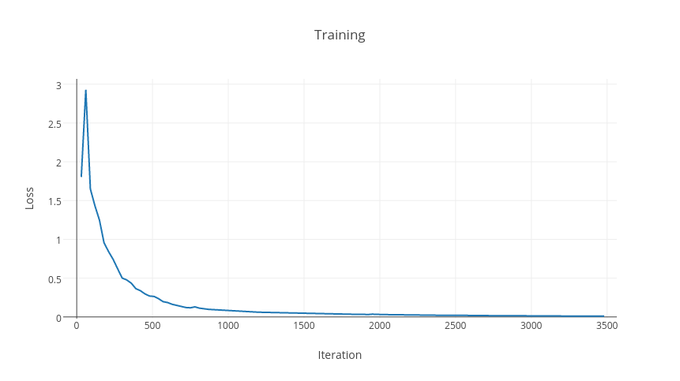

## Status

Work in progress (not cleaned up)

## Model

Multi-layered LSTM was used for the change of pose regression.

## Regularization

Dropout.

## Preliminary results

### Training loss visualization

The results of the training are shown on the graph below:

### Validation set loss

The validation set loss was equal to 0.001 (1 mm)